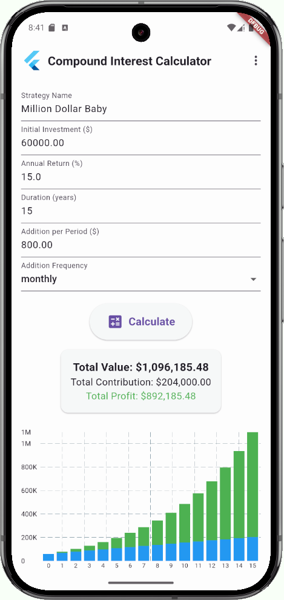
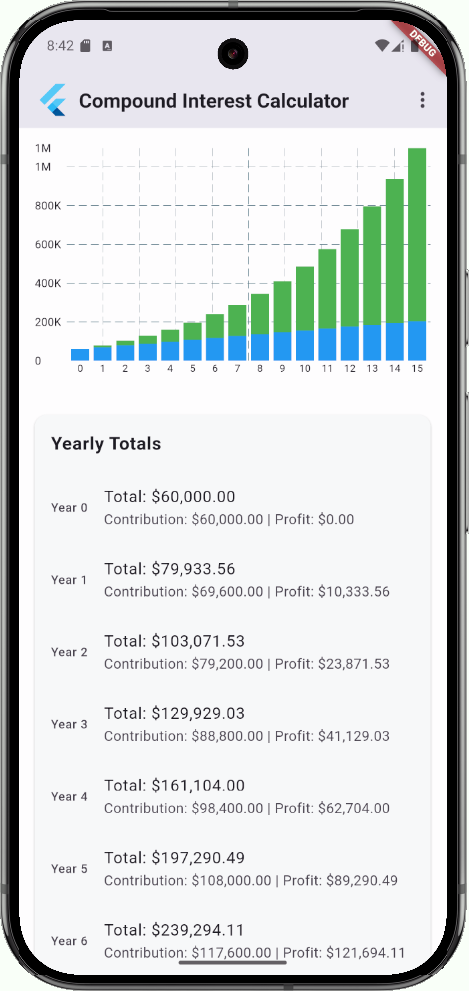
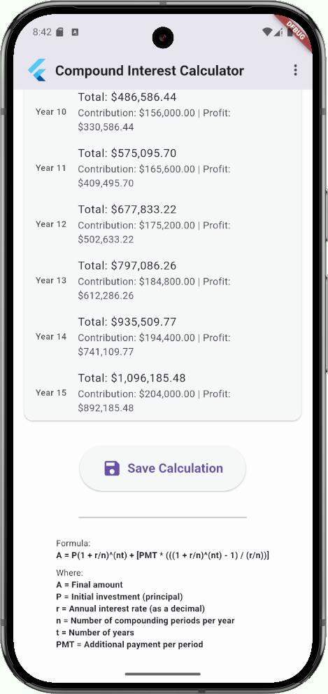
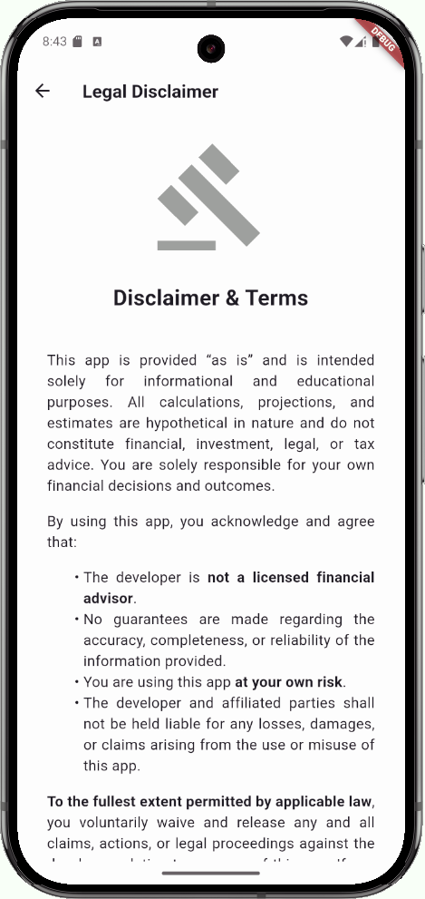
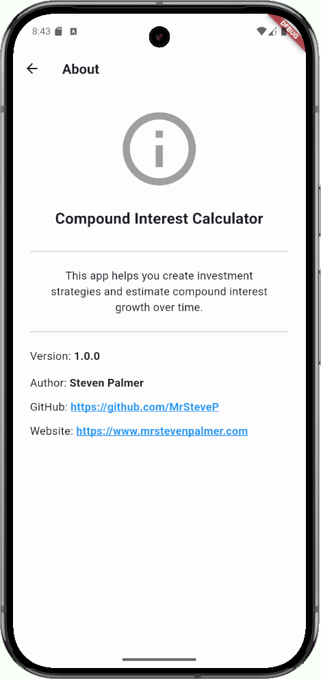

# Compound Interest Calculator

This Flutter application allows users to calculate compound interest based on their investment details. Users can input their initial investment, expected annual return, duration, and additional contributions with various frequencies. The app also enables users to save multiple calculations, load previous calculations, and visualize the data through bar charts.

## Features

- User-friendly input for:
  - Initial investment amount
  - Expected annual return rate
  - Investment duration (years)
  - Additional contributions with selectable frequency
- Calculates and displays:
  - Total investment value, total contributions, and total profit year over year
- Visualizes results with interactive bar charts
- Provides a detailed yearly breakdown of contributions and profits
- Allows saving and loading of multiple investment strategies
- Automatically preserves your last entered values between sessions

## Screenshots





## Project Structure

```
compound_interest_calculator
├── assets
│   └── disclaimer.html
├── lib
│   ├── main.dart
│   ├── models
│   │   └── calculation.dart
│   ├── screens
│   │   ├── about_screen.dart
│   │   ├── disclaimer_screen.dart
│   │   ├── home_screen.dart
│   │   └── saved_calculations_screen.dart
│   ├── services
│   │   └── storage_service.dart
│   ├── utils
│   │   ├── disclaimer_prefs.dart
│   │   └── formulas.dart
│   └── widgets
│       ├── app_popup_menu.dart
│       ├── bar_chart.dart
│       ├── calculation_summary.dart
│       ├── disclaimer_dialog.dart
│       ├── input_form.dart
│       └── yearly_totals_list.dart
├── LICENSE.md
├── pubspec.yaml
└── README.md
```

## Installation

1. Clone the repository:
   ```
   git clone <repository-url>
   ```
2. Navigate to the project directory:
   ```
   cd compound_interest_calculator
   ```
3. Install the dependencies:
   ```
   flutter pub get
   ```

## Usage

1. Run the application:
   ```
   flutter run
   ```
2. Input your investment details in the home screen.
3. View the results, including total investment value, total contribution, and total profit.
4. Save your calculations for future reference.
5. Visualize your data with the bar chart and yearly totals.

## Contributing

Contributions are welcome! However, please reach out first before spending any time working on any issue or submitting a pull request for any enhancements or bug fixes.

## License

This project is licensed for **non-commercial use only** under the [Custom Non-Commercial License](LICENSE).

For commercial use, please contact me at me@mrstevenpalmer.com to obtain a commercial license.

NOTE: An upgraded "Pro" version of this project, with additional features, is also available. Additional features include export/share to PDF, light/dark mode, and other UX/UI improvements.
